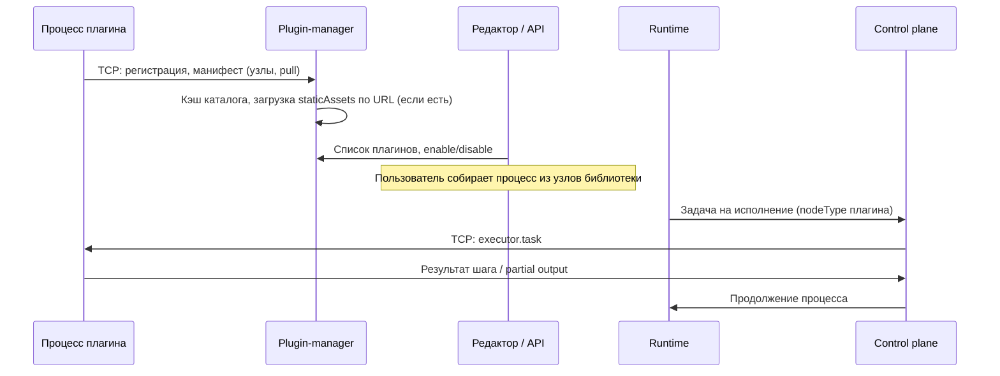

# Плагины Conveyor

Репозиторий **внешних интеграций** платформы [Conveyor](https://conveyor.digital). Каждый пакет — отдельный Node-процесс: он публикует манифест в plugin-manager и добавляет узлы в библиотеку редактора (Jira, Telegram, LLM, почта, офисные форматы и др.).

Контракт разработки — npm-пакет [`@kosolapus/plugin-ts-sdk`](https://www.npmjs.com/package/@kosolapus/plugin-ts-sdk). Для локальной проверки достаточно этого репозитория и Docker-образа ядра [`kosolapus/conveyor-demo`](https://hub.docker.com/r/kosolapus/conveyor-demo) с Hub.

## Быстрый старт

Понадобятся Docker, npm и Node.js **22+** на хосте (образы плагинов в [`Dockerfile.plugin`](Dockerfile.plugin) собираются на Node 24).

Склонируйте репозиторий и из его корня поднимите demo вместе с четырьмя примерными плагинами:

```bash
git clone git@github.com:flowforge-orchestrator/plugins.git
cd plugins
docker compose -f compose.demo.yml up -d --build
```

Команда стартует контейнер **demo** (UI, API, plugin-manager, runtime из образа Hub) и собирает sidecar-сервисы **jira**, **telegram**, **llm**, **caldav** из исходников этого репозитория. Плагины ждут, пока demo пройдёт healthcheck plugin-manager, затем подключаются к ядру по DNS-имени **`demo`** и общим переменным anchor `*plugin-to-demo` в [`compose.demo.yml`](compose.demo.yml). После публикации манифеста узлы появляются в каталоге платформы.

Первый запуск занимает около **минуты**: demo инициализирует PostgreSQL и дожидается готовности plugin-manager.

Откройте UI по адресу из `PUBLIC_SITE_URL` (по умолчанию `http://localhost:8080`). Войдите с учётной записью demo: email **`admin-test@flowforge.local`**, пароль **`Test123456!`**. Другие seed-учётки и порты — в [`compose.env.example`](compose.env.example).

Только ядро без плагинов:

```bash
docker compose -f compose.demo.yml up -d demo
```

Версия SDK зафиксирована в корневом `package.json` → `overrides` (**0.0.10**). Тег demo задаётся переменной `DEMO_IMAGE_REF` (по умолчанию `kosolapus/conveyor-demo:latest`). Перед обновлением SDK сверьте `npm view @kosolapus/plugin-ts-sdk version` и совместимость с используемым образом demo.

Обзор платформы — [conveyor.digital/docs](https://conveyor.digital/docs). Порты, токены и переменные compose — [`compose.env.example`](compose.env.example).

## Состав

| Каталог | Назначение |
| --- | --- |
| [`telegram/`](telegram/) | Отправка сообщений в Telegram — [README](telegram/README.md) |
| [`jira/`](jira/) | Работа с Jira (issues и связанные операции) — [README](jira/README.md) |
| [`redmine/`](redmine/) | Redmine API — [README](redmine/README.md) |
| [`llm/`](llm/) | Генерация через Ollama/OpenAI — [README](llm/README.md) |
| [`caldav/`](caldav/) | CalDAV: календари и CRUD событий — [README](caldav/README.md) |
| [`rag/`](rag/) | RAG по документам (вектор + граф + ask) — [README](rag/README.md); композ [`compose.rag.yml`](compose.rag.yml) |
| [`email/`](email/) | Исходящая почта (SMTP) — [README](email/README.md) |
| [`office/`](office/) | Чтение и запись XLSX, CSV, DOCX — [README](office/README.md) |
| [`plugin-build-tools/`](plugin-build-tools/) | Общие скрипты сборки (`esbuild`, обрезка `dist/`) |
| [`compose.demo.yml`](compose.demo.yml) | Demo-ядро + jira, telegram, llm, caldav |
| [`docker-compose.yml`](docker-compose.yml) | Все семь плагинов-пакетов для внешнего ядра |
| [`Dockerfile.plugin`](Dockerfile.plugin) | Multi-stage образ одного плагина |
| [`.cursor/skills/`](.cursor/skills/) | Agent skills для разработки и запуска |

В [`compose.demo.yml`](compose.demo.yml) для quick start поднимаются **четыре** пакета из семи. Остальные подключаются через [`docker-compose.yml`](docker-compose.yml) или отдельный сервис по образцу `jira`.

## Запуск с demo-образом

Основной сценарий — sidecar-плагины в одной Docker-сети с контейнером demo:

```bash
docker compose -f compose.demo.yml --env-file compose.env.example up -d --build
```

Правила портов и env — skill **plugin-run-local** ([`reference.md`](.cursor/skills/plugin-run-local/reference.md)).

## Подключение к своему стенду

Сценарий для контура, где **plugin-manager** и **runtime-control-plane** уже работают в общей Docker-сети.

Сначала убедитесь, что PM и CP запущены и используют одну user-defined network (например `conveyor`). В [`docker-compose.yml`](docker-compose.yml) раскомментируйте блок `networks` в конце файла и укажите имя этой сети с `external: true`. Переменные RPC, control plane и токены возьмите из секции prod-like в [`compose.env.example`](compose.env.example). У каждого сервиса плагина `PLUGIN_PULL_ADVERTISED_HOST` должен совпадать с DNS-именем сервиса в compose.

Затем из корня репозитория:

```bash
docker compose --env-file compose.env.example up -d --build
```

Файл [`docker-compose.yml`](docker-compose.yml) поднимает **все** плагины-пакеты. Ядро он не стартует.

## Как добавить свой плагин

### С агентом (Cursor)

Точка входа — [`AGENTS.md`](AGENTS.md) (skills **plugin-author**, **plugin-run-local**).

### Вручную

Изучите контракт SDK — skill **plugin-author** или [Разработка плагина](https://conveyor.digital/docs/plugins/develop). Скопируйте publication wiring из [`example-plugin/`](.cursor/skills/plugin-author/example-plugin/): `example-batch.source.ts`, `example-manifest.builder.ts`, `app.module.ts`. Добавьте каталог в `"workspaces"` [`package.json`](package.json) и настройте `conveyorPluginBuild` (см. ниже).

Сборка и запуск на хосте:

```bash
npm install
npm run build -w @conveyor/plugin-<имя>
cd <имя>
cp env.example .env   # если есть; иначе скопируйте telegram/env.example и поправьте порты
npm start
```

Хосты, порты RPC и токены — [`compose.env.example`](compose.env.example). Образец env для sidecar — [`telegram/env.example`](telegram/env.example) (demo и external stack — комментарии внутри файла).

Новый сервис в compose добавьте по образцу `jira` в [`compose.demo.yml`](compose.demo.yml) или [`docker-compose.yml`](docker-compose.yml).

**Правила манифеста:** сверяйте поля с типами `@kosolapus/plugin-ts-sdk`; publication wiring берите из [`example-plugin/`](.cursor/skills/plugin-author/example-plugin/). **Запрещено:** поля, которых нет в SDK, и произвольные расширения «на глаз».

## Как проверить, что всё работает

После `docker compose -f compose.demo.yml up` откройте UI и войдите под demo-учёткой (см. [Быстрый старт](#быстрый-старт)).

В редакторе откройте вкладку **«Плагины»** в левой колонке. Найдите интеграцию в списке и **включите переключатель**. Статус «онлайн» означает, что plugin-manager видит исполнитель. Секреты и параметры узлов настраиваются **в полях узла на канвасе** (тип `ref` → «Хранилище»), а не на уровне карточки плагина: в манифестах пакетов этого репозитория `variables` пусты.

На вкладке **«Палитра»** должны появиться узлы `plugin.<id>.*`. Соберите процесс с одним таким узлом и выполните ручной запуск.

В логах sidecar-плагина ищите `plugin_wire_outbound_manifest_ok`, в логах demo (plugin-manager) — `plugin_publication_committed`. Health с хоста (порты из [`compose.env.example`](compose.env.example)):

```bash
curl -fsS "http://127.0.0.1:${DEMO_PM_HEALTH_PORT}/health"
curl -fsS "http://127.0.0.1:${DEMO_WEB_PORT}/health"
```

Если плагин публикует **`staticAssets`**, в логах plugin-manager после публикации появится `plugin_static_cached`. Паттерн — [`example-plugin/src/patterns/static-ui/`](.cursor/skills/plugin-author/example-plugin/src/patterns/static-ui/).

При **`unauthorized`** сверьте `PLUGIN_MANAGER_INGRESS_TOKEN` и `PLUGIN_CONTROL_PLANE_KEY` с [`compose.env.example`](compose.env.example). Если plugin-manager не получает batch, проверьте `PLUGIN_PULL_ADVERTISED_HOST` и порт executor: адрес должен быть достижим из контейнера demo (DNS-имя sidecar-сервиса или `host.docker.internal` с хоста).

## Обновление плагина (после пересборки)

После изменения кода, bump `publicationVersion` или `docker compose build` платформа может продолжать использовать старую публикацию или привязку workspace. Выполните шаги **в этом порядке**:

1. **Отключите и удалите** плагин в UI — вкладка **«Плагины»**, под **учётной записью с правами администратора** (admin workspace / глобальный admin — как принято на вашем стенде).
2. **Перезапустите** sidecar плагина — например `docker compose restart <service>` или `docker compose up -d --build <service>`.
3. **Включите** плагин снова — вкладка **«Плагины»**, уже под **нужной рабочей учётной записью** (той, под которой собираете процессы).

Проверка: в логах sidecar — актуальный `publicationVersion`; в plugin-manager — `plugin_publication_committed`; в «Палитре» — узлы плагина, статус **«онлайн»**.

Подробнее для агентов — skill **plugin-run-local** ([`SKILL.md`](.cursor/skills/plugin-run-local/SKILL.md#after-plugin-update-rebuild)).

## Как плагин стыкуется с платформой



| Шаг | Что происходит | Где смотреть |
| --- | --- | --- |
| 1. Старт | Nest-приложение, env подключения к PM и control plane | [`compose.demo.yml`](compose.demo.yml), [`telegram/env.example`](telegram/env.example) |
| 2. Публикация | Описание узлов и адрес **pull** для batch исполнителей | SDK; образец — [`example-batch.source.ts`](.cursor/skills/plugin-author/example-plugin/src/example-batch.source.ts) |
| 3. Каталог | PM сохраняет манифест; API отдаёт список и библиотеку | «Плагины», «Палитра» |
| 4. Запуск процесса | Runtime отправляет задачу в control plane | Ядро в demo-образе |
| 5. Исполнение | CP маршрутизирует задачу на TCP-порт плагина | SDK: `ExecutorTaskTcpController` |

Эталон publication wiring — [`example-plugin/`](.cursor/skills/plugin-author/example-plugin/) в этом репозитории.

## Технические детали

### Workspace (сборка на хосте)

```bash
npm install
npm run build --workspaces --if-present
npm run build -w @conveyor/plugin-office
```

Сборка пакета: `tsc` → `copy:help` → `bundle` → `prune:dist`.

### `conveyorPluginBuild` (в `package.json` плагина)

| Поле | Значение |
| --- | --- |
| `helpMarkdown` | `"empty"` / `"firstInDist"` / `{ "distRelativePath": "…/help.md" }` |
| `bundleMarkdownAsText` | `true` — импорт `.md` как строк в исполнителях |

### Agent skills (Cursor)

Skills лежат в [`.cursor/skills/`](.cursor/skills/); маршрутизация — [`AGENTS.md`](AGENTS.md). Cursor подхватывает их как project skills.

### Порты и env

Skill **plugin-run-local**. Значения по умолчанию — [`compose.env.example`](compose.env.example), [`compose.demo.yml`](compose.demo.yml), [`docker-compose.yml`](docker-compose.yml).

### Образ одного плагина

```bash
docker build -f Dockerfile.plugin --build-arg PLUGIN_DIR=jira -t plugin-jira:latest .
```
